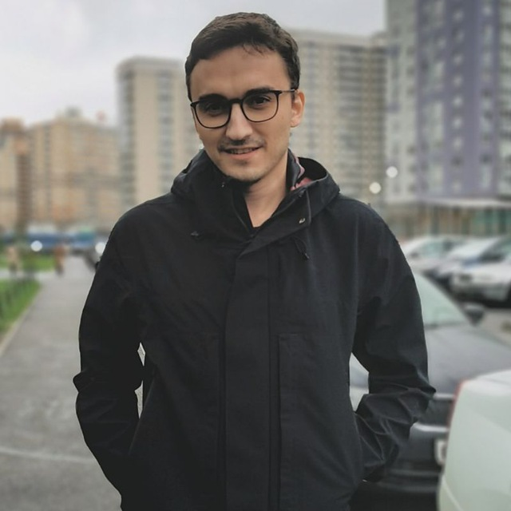

# Aleksei Kulaev

#### _Security researcher_ / _Former Malware Analyst Team Lead_

- E-mail: <alex.qart@gmail.com>
- X (Twitter): <https://x.com/flat_z>
- Telegram: [@flatz](https://t.me/flatz)
- LinkedIn: <https://www.linkedin.com/in/aleksei-kulaev-1a0176131/> (_outdated_)
- GitHub: <https://github.com/flatz> (_some of public projects are hosted there_)

## About

I'm a security researcher and software developer with a long-term experience which started at 6 years old when I created my first calculator of electronic circuits for my father. I've been a Lead Malware Analyst of Kaspersky’s Exploit Detection team and their team lead for several years and then become an independent security researcher, focused mostly on MacOS and iOS mobile platforms.

Also I’m a known console hacker (Playstation 3/4/5, and Xbox One to a lesser degree) who made significant contributions to the hacking scene and has many contacts in hacking communities.

My main interests are reverse-engineering and vulnerability research in different areas such as popular desktop/mobile OS, gaming consoles, IoT devices and different embedded systems. I like to dive into hardware/software security, cryptography and protocols, writing tools to help with developing and automating my work.

Also I'm learning hardware hacking and have some experience in finding debugging buses, dumping flash chips, analyzing communication protocols and automating. My future plans are getting more experience on glitch attacks and learning FPGA to build my own stuff.

In the past I’ve mainly used C/C++ for my projects, then moved to Python for faster prototyping and recently started to use Rust as my main programming language.

## Skills

- 20+ year experience of high-level programming languages (_C/C++, Python, JavaScript, Java, C#, Lua, PHP, Delphi/Pascal and now Rust_);
- 10+ year experience on reverse engineering of assembly languages (_x86-64, ARM, AArc64, PowerPC64, H8S, MIPS, RL78, AM32, Xtensa_);
- Good knowledge of reverse engineering tools (_IDA Pro, Radare, Ghidra_) and debuggers (_WinDBG, GDB, LLDB, Ptrace-like things_);
- Deep understanding of operating systems (_Windows, FreeBSD, Linux, Kaspersky OS and some embedded/real-time OS such as ThreadX_), hypervisors and trusted platforms;
- Practical experience of writing applications, drivers, bootloaders, firmwares and debuggers;
- Wide knowledge of file formats and protocols, reverse-engineering unknown and proprietary file formats, compression algorithms;
- Good knowledge of cryptographic algorithms;
- Fast learning of work processes and projects, programming and assembly languages;
- Understanding and improving of legacy and other people's code;
- Good teamwork, participating in brainstorming and sharing of experience and also leading work projects from scratch, and often independently;
- Hard work and diligence, diving into internals for getting better practical experience, continuous self-education and personal development.

## Work experience

- **Independent Security Researcher** (_Belgrade, Serbia – Dubai, UAE_) \[_Freelance_], 2023-2024:
    - Developing and improving of kernel debugging through virtualization;
    - Vulnerability researching, analyzing of 0-days/N-days;
    - PoC testing, porting and code improving for better coverage and reliability;
    - Reverse-engineering of various device firmwares.
- **Kaspersky** (_Moscow, Russia_) \[_Full-time_], 2019-2023 – 3 years (office), 1+ year (remote):
    - Positions:
        * Senior Malware Analyst (_Jan 2019 - Apr 2021_)
        * Lead Malware Analyst (_Apr 2021 - Apr 2022_)
        * Malware Analyst Team Lead (_Apr 2022 - Mar 2023_)
    - Key responsibilities:
        * Detections of local/remote exploits in OS and applications;
        * Vulnerability researching, writing detailed technical analysis of 0-days/N-days, information disclosure to vendors;
        * Reviewing and penetration testing of company/partners products;
        * Implementing file formats and protocol parsers;
        * Optimizing of scanning engines, heuristic and behavior based algorithms;
        * Writing technical articles related to vulnerabilities and exploits;
        * Analyzing of Big Data for collecting statistics on recent attacks and detections;
        * Reviewing of source code;
        * Automating of malware/exploit analysis and discovering of new threats/PoC, internal testing.
- **Freelance** (_Russia_) \[_Remote_], 2006-2019:
  - Leading software & web development in areas such as sales management, remote education, logistics and statistics.

## Personal projects of recent years

- **AMD's Platform Security Processor (PSP)**:
  - Reverse-engineering of available PSP code;
  - Developing customized firmware with RPC interface after gaining code execution for further researching;
  - Poking of undocumented MMIO space for getting access to internal blocks and their reverse-engineering;
  - Gaining code execution on other (co)processors;
  - Discovering design flaws in cryptographic coprocessor (CCP) and other security issues, dumping CCP key slots;
  - Obtaining hidden (locked) BootROM;
  - Developing PSP bootloader decryption tool.
- **Sony Playstation 5**:
  - Gaining userland code execution through bug in Lua VM via crafted Save Game;
  - Gaining userland code execution through Java via vulnerable Blu-Ray disc;
  - Achieving kernel read/write primitives and further code execution using several exploits;
  - Bypassing hypervisor and dumping hidden kernel/userland code;
  - Discovering method to obtain cryptographic key slots from cryptographic coprocessor;
  - Decrypting the entire boot chain code and obtaining all other security keys;
  - Discovering bugs and writing their exploits for dumping of memory, gaining code execution and cryptographic keys on other auxiliary devices (e.g. debugging kits) and several external processors.
  - Developing decryption tools and plugins for IDA.
- **MacOS/iOS**:
  - Enhancing kernel-level debugging on MacOS using hypervisor (m1n1), fixing multiple major bugs in m1n1’s source code related to GDB server functionality;
  - Developing debugging method for XNU kernel and system/userland applications using Virtualization.framework that allows any code modifications and booting of custom kernel extensions under virtual machines;
  - Discovering several bugs related to Apple Neural Engine (ANE)
  - Developing method for bypassing Pointer Authentication Code (PAC).
- **Sony Playstation 4**:
  - Gaining userland code execution through multiple bugs in WebKit/JSC engine;
  - Exploiting kernel using multiple bugs for gaining memory dump and code execution;
  - Discovering cryptographic and design flaws in security coprocessor and crypto-accelerator;
  - Decoding of mask ROM and eFuses to obtain BootROM code containing undocumented proprietary processor’s instructions, developing processor plugin for IDA;
  - Glitching of the system controller, gaining memory dumps and achieving code execution on several other system components, dumping eMMC storage from PSVR device; replicating existing attack on Blu Ray device, continuing this work for further exploitation.
  - Reverse-engineering of the entire system and developing decryption and other tools.
- **Microsoft Xbox One**:
  - Exploiting multiple bugs in ChakraCore’s JSC engine to get userland code execution;
  - Achieving kernel read/write primitives and escalating system privileges.
- **Aqara Hub**:
  - Discovering debugging pins, exploiting bootloader for gaining memory dump and code execution, dumping flash storage;
  - Discovering  cryptographic flaws to get encryption/signing keys, further decrypting of device’s firmware;
  - Unlocking access to the device’s Linux shell from their mobile application.
- **LG TVs** _(WebOS based)_:
  - Achieving userland code execution using USB flash drive;
  - Exploiting Linux kernel for gaining memory dumps and kernel code execution.

## Awards

- Performance League of Kaspersky Team (_2021-2022_).

## Teaching experience

- Lecturer for course of **_Malware Reverse Engineering_**, Singapore (_53 hours including lectures, practical exercises and exams_).

## Education

- Bachelor's degree in Automation Engineer Technology, Yelets State University of Bunin (_2007-2012_).

## Languages

- English (_professional working proficiency_);
- Russian (_native proficiency_).
